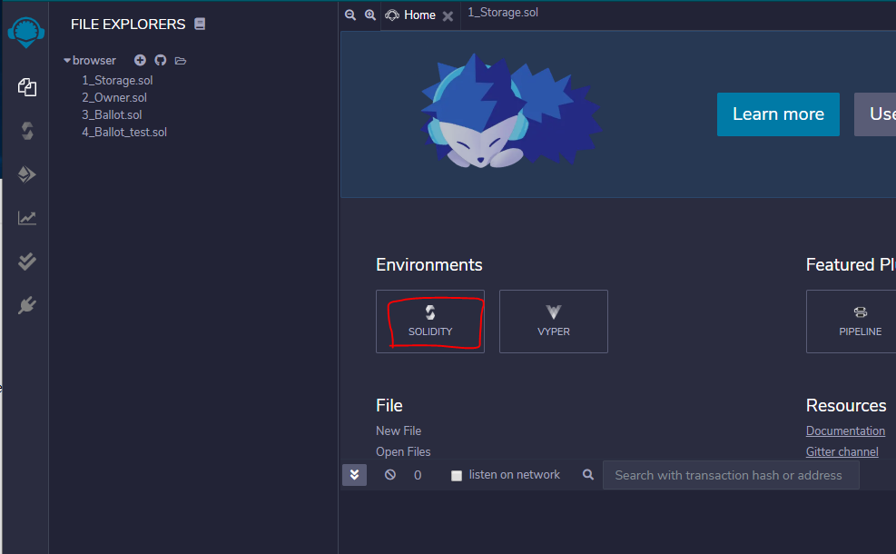
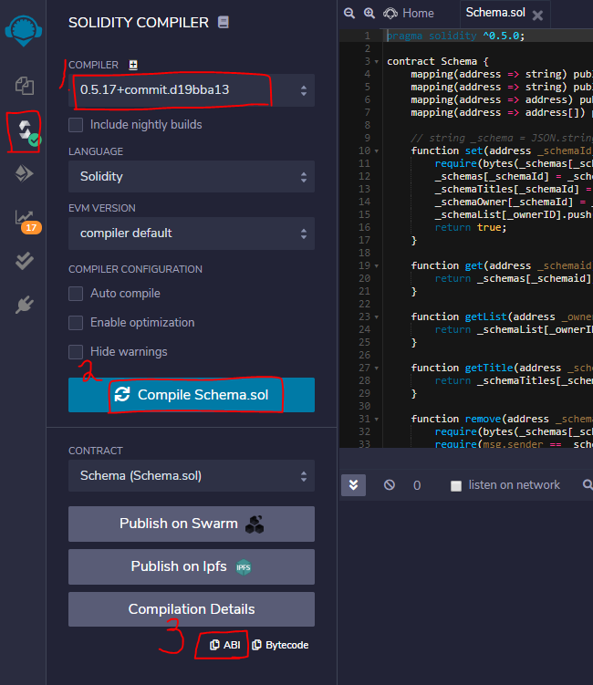
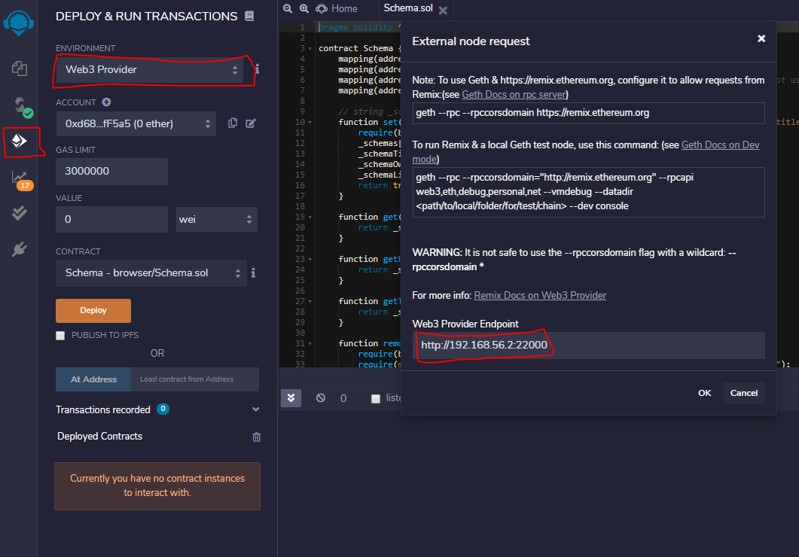
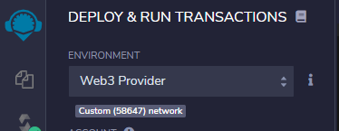
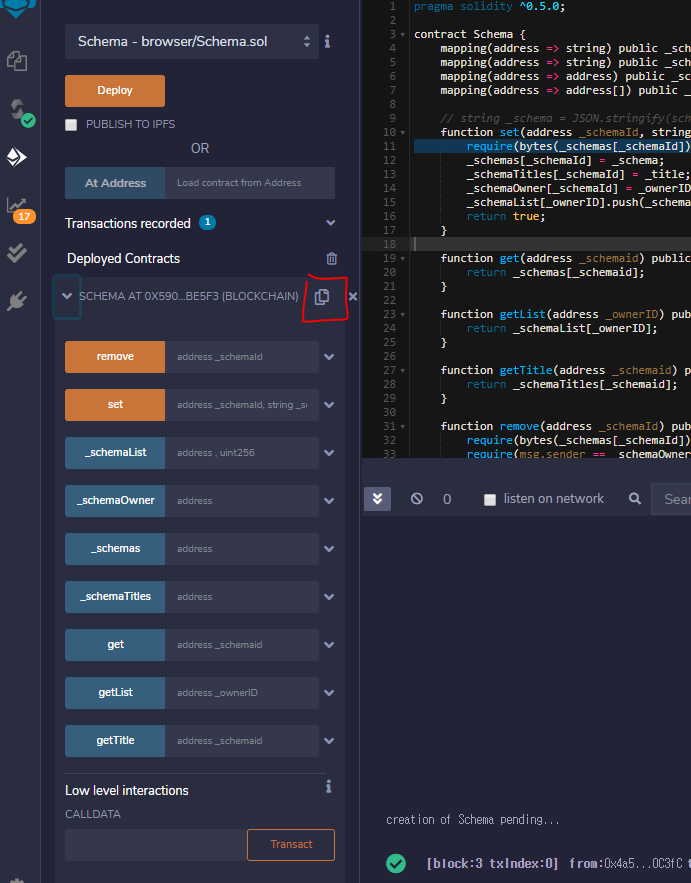

# Quorum Network 

## 목차
  * [0. 개요](#%eb%aa%a9%ec%b0%a8)
  * [1. Create Quorum](#1-create-quorum)
  * [2. Deploy Contact](#2-deploy-contract)
  * [3. Run Contract in Web3](#3-run-contract-in-web3)
  * [기타](#%ea%b8%b0%ed%83%80)
## 0. 개요
  * Quorum: Ethereum 기반의 Private Network
## 1. Create Quorum
**[출처(사내 Wire)](!wire.lgcns.com/bitbucket/projects/BLOCKCHAIN/repos/eth-petshop/browse)**
### 1.1. Install & Setup
```bash
git clone https://github.com/synechron-finlabs/quorum-maker.git
cd quorum-make
./setup.sh

# 1. Create Network 선택
# Enter node name
# Enter IP Address
# RPC Port(default:22000)
# Network Listening Port(default:22001)
# Constellation Port(default:22002)
# Raft Port(default:22003)
# Node Manager Port(default:22004)
# WS Port(default:22005)
#
# http://IP Address:22004/ 확인
```
### 1.2. Customizing

  * 새로운 터미널을 열어 네트워크를 내린 후 수정
```bash
docker ps | grep start_testnode.sh | awk '{print $1}' | xargs -t docker stop
```

```bash
# testnode/node/start_testnode.sh 수정
#
# --unlock 0 --password <(echo -n "")> 추가
# 모든 address에게 contract deploy 권한을 주는 옵션
PRIVATE_CONFIG=qdata/$NODE_NAME.ipc geth --verbosity 6 --datadir qdata $GLOBAL_ARGS --rpccorsdomain "*" --raftport $RA_PORT --rpcport $R_PORT --port $W_PORT --ws --wsaddr 0.0.0.0 --wsport $WS_PORT --wsorigins '*' --wsapi $ENABLED_API --nat extip:$CURRENT_NODE_IP 2>>qdata/gethLogs/${NODE_NAME}.log &

==>

PRIVATE_CONFIG=qdata/$NODE_NAME.ipc geth --unlock 0 --password <(echo -n "")> --verbosity 6 --datadir qdata $GLOBAL_ARGS --rpccorsdomain "*" --raftport $RA_PORT --rpcport $R_PORT --port $W_PORT --ws --wsaddr 0.0.0.0 --wsport $WS_PORT --wsorigins '*' --wsapi $ENABLED_API --nat extip:$CURRENT_NODE_IP 2>>qdata/gethLogs/${NODE_NAME}.log &
```
  * 재기동
```bash
cd testnode
./start.sh
```

## 2. Deploy Contract
### 2.1. Sample Contarct download
```bash
# eth-petshop/contracts/Schema.sol 사용
git clone https://wire.lgcns.com/bitbucket/scm/blockchain/eth-petshop.git
```
### 2.2. Deploy on Remix
  1. remix.ethereum.org 접속
   
  2. Environments에서 Solidity 선택
    

  3. Add Schema.sol
    

  4. Compile Schema.sol
    
    
    1. 버전에 맞는 컴파일러 선택
       *.sol의 최상단 참조
    2. Compile Schema.sol
    3. ABI Copy(Clipboard) (차후 활용 1)
  5. Deploy & Run
    

    1. Web3 Provider 선택
    2. "1.1."를 통해 구축한 정보를 입력 (RPC default port: 22000)
    3. OK (성공화면: [4-1])
    4. Deploy (성공화면: [4-2])
    5. [4-2]에 표시한 버튼을 눌러 Contract Address 획득 (차후 활용 2)
   * [4-1]<br>
   
   * [4-2]<br>
   

## 3. Run Contract in Web3
  * [참고] Remix에서도 Transaction을 발생시킬 수 있다.
### 3.1. web3 환경 구성
```bash
mkdir web3test
cd web3test
npm init
# Enter로 기본값 설정
sudo npm install web3
vim index.js
```
```js
const Web3 = require("web3")
const web3 = new Web3("http://192.168.56.2:22000")
// Schema.sol's ABI
const abi = [...]
// Deployed Contract Address
const address = "0x590c9404D974a845eb71372c84B60106e0DBe5F3"
const contractInstance = new web3.eth.Contract(abi, address)

///////////////////////////////////////////////////////
//
//                   CURD Example
//     
//     Create (Create는 Gas 필요)
//     solidity의 address type을 준수해야 함
//
// contractInstance.methods.set("0x4a5F7AC37f6E4f6bA81d2Cda4eE00f5d47A0C3fC", "Hello World", "0x4a5F7AC37f6E4f6bA81d2Cda4eE00f5d47A0C3fC", "Hello Title").send({from: "0x4a5F7AC37f6E4f6bA81d2Cda4eE00f5d47A0C3fC", gas: 800000}, function(error, transactionHash){ console.log(error) })
//
//     Read
//
// contractInstance.methods.get('0x4a5F7AC37f6E4f6bA81d2Cda4eE00f5d47A0C3fC').call({from: '0x4a5F7AC37f6E4f6bA81d2Cda4eE00f5d47A0C3fC'}, function(error, result){console.log(result)})
//
//     Delete
// contractInstance.methods.remove("0x4a5F7AC37f6E4f6bA81d2Cda4eE00f5d47A0C3fC").send({from: "0x4a5F7AC37f6E4f6bA81d2Cda4eE00f5d47A0C3fC", gas: 800000}, function(error, transactionHash){ console.log(error) })
//
////////////////////////////////////////////////////////
```
```bash
# 실행
node index.js
```

## 기타
* [Deploy Contract to Quorum Network](!https://developers.sap.com/tutorials/blockchain-quorum-test-smartcontract.html)
* [Remix](!http://remix.ethereum.org/)
* [Web3 doc](!https://web3js.readthedocs.io/)
* [Quorum official](!https://docs.goquorum.com/)
---
**<center>2020-04-00 강재구</center>**
